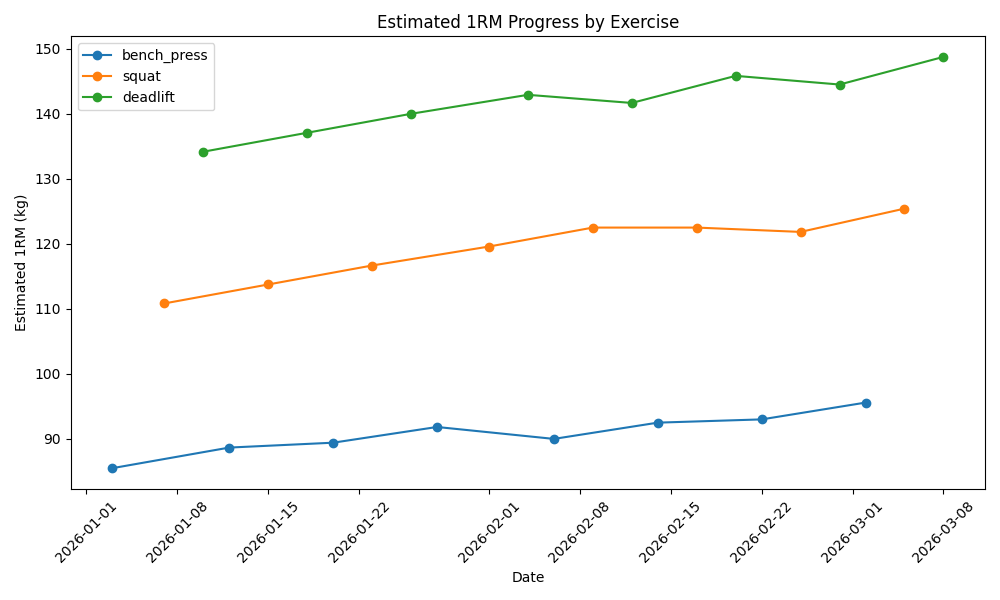
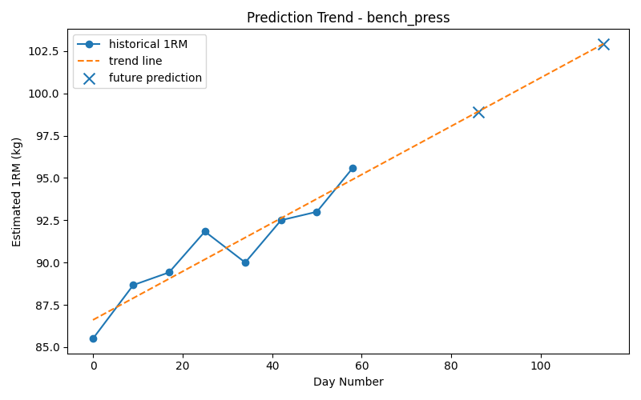
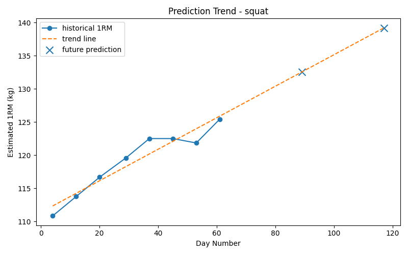
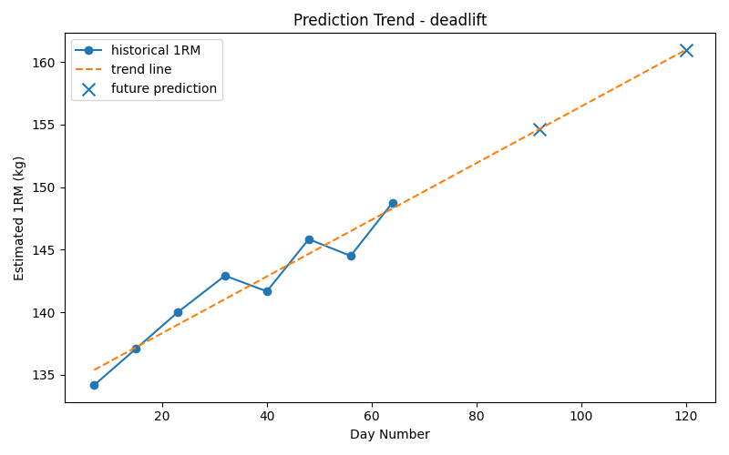

🚀 Live Demo: https://workout-ai-749174075455.us-central1.run.app/docs
# AI Workout Progress Predictor

A machine learning project that analyzes strength training logs and predicts future performance.

This project takes historical workout data (bench press, squat, deadlift) and provides:

- Estimated 1RM progression
- Future strength prediction
- Plateau risk detection
- Training progress reports

---

# Project Motivation

Many strength athletes track their workouts but struggle to understand:

- Whether their strength is actually improving
- When they are approaching a plateau
- What their future performance might look like

This project aims to convert raw workout logs into meaningful training insights.

---

# Features

### 1. Workout Data Validation
Load and validate CSV workout logs.

### 2. Feature Engineering
Compute key training metrics such as:

- Estimated 1RM
- Training volume
- Session index
- Training timeline

Estimated 1RM is calculated using the Epley formula:

1RM = weight × (1 + reps / 30)

### 3. Strength Progress Prediction

A Linear Regression model predicts:

- 4-week estimated 1RM
- 8-week estimated 1RM

Each exercise is modeled independently.

### 4. Plateau Detection

The system detects possible training plateaus by analyzing:

- Recent estimated 1RM change
- Training volume trend

Plateau risk is classified as:

- Low
- Medium
- High

### 5. Progress Report Generation

A readable training report is generated that summarizes:

- Current estimated strength
- Future strength prediction
- Plateau risk assessment

---

# Project Structure
ai-workout-progress-predictor/

data/
raw/
sample_workout.csv

outputs/
reports/

src/
load_data.py
preprocess.py
feature_engineering.py
predict.py
plateau_detection.py
report.py

main.py
requirements.txt
README.md

---

# Example Input

Example workout log format:
date,exercise,weight,reps,sets,rpe
2026-01-03,bench_press,67.5,8,3,8
2026-01-07,squat,95,5,3,8
2026-01-10,deadlift,115,5,3,8

Supported exercises:

- bench_press
- squat
- deadlift

---

# Example Output
================ WORKOUT PROGRESS REPORT ================

Exercise: bench_press
Current estimated 1RM: 98.17 kg
Predicted 4-week 1RM: 101.25 kg
Predicted 8-week 1RM: 104.33 kg
Plateau risk: Low
Reason: Estimated 1RM has improved over the last 4 sessions.

## Visualization

### Estimated 1RM Progress

### Prediction Trend Examples

---

# How to Run

### 1. Install dependencies
pip install -r requirements.txt

### 2. Run the program
python main.py

The program will:

1. Load workout data
2. Process training logs
3. Compute training features
4. Predict future strength
5. Detect plateau risk
6. Generate a progress report

---

# Future Improvements

Possible future extensions:

- Data visualization of strength progress
- REST API using FastAPI
- Cloud deployment (Google Cloud Run)
- Integration with fitness tracking apps
- More advanced ML models

---

# License

This project is for educational and research purposes.

# Live API

The project is deployed on Google Cloud Run.

Base URL:
https://YOUR_CLOUD_RUN_URL

## Available Endpoints

### Health Check
GET /health

### Analyze Workout
POST /analyze

Upload a CSV file to receive:

- Strength prediction (4-week / 8-week)
- Plateau detection
- Training score

You can test it via:
https://workout-ai-749174075455.us-central1.run.app/docs

# Deployment

This project is deployed using:

- Docker
- Google Cloud Run
- Artifact Registry

Steps:

1. Build container with Cloud Build
2. Push to Artifact Registry
3. Deploy to Cloud Run
